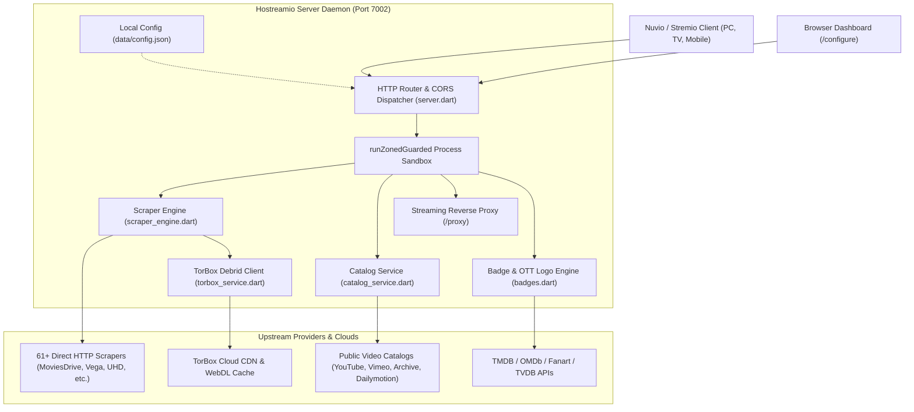
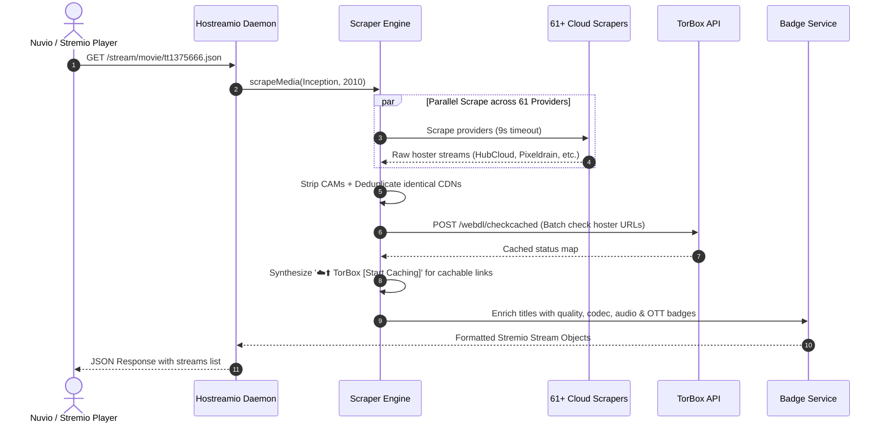

# 🏛️ Hostreamio Addon Architecture & Developer Guide

> **Target Audience:** Future AI Agents, Core Contributors, and Human Maintainers.  
> **Mission:** High-performance local Stremio & Nuvio-compatible addon server featuring 61+ direct HTTP/HLS cloud scrapers, TorBox debrid integration, public catalogs (YouTube, Vimeo, Internet Archive, Dailymotion), smart proxying, and instant badges for Windows and Android TV / Mobile.

---

## 📑 Table of Contents
1. [Executive Summary & Core Philosophy](#1-executive-summary--core-philosophy)
2. [High-Level System Architecture](#2-high-level-system-architecture)
3. [Subsystem Breakdown & Code Organization](#3-subsystem-breakdown--code-organization)
4. [🚨 Critical "Do NOT Break" Architectural Invariants](#4--critical-do-not-break-architectural-invariants)
5. [API Routes & Protocol Specifications](#5-api-routes--protocol-specifications)
6. [Catalog & Poster Engine (16:9 Landscape vs 2:3 Portrait)](#6-catalog--poster-engine)
7. [Scraper Engine & TorBox Dual-Rail Flow](#7-scraper-engine--torbox-dual-rail-flow)
8. [Developer Workflows (Build, Test, Deploy)](#8-developer-workflows)
9. [How to Add a New Scraper / Provider](#9-how-to-add-a-new-scraper--provider)
10. [Troubleshooting & Known Traps](#10-troubleshooting--known-traps)

---

## 1. Executive Summary & Core Philosophy

Hostreamio is a **100% non-torrent (zero P2P)** stream aggregation engine. It connects media clients (Nuvio and Stremio) with direct cloud hosters, regional OTT platforms, and public video archives.

### Core Principles
- **No P2P / No Seeding:** Hostreamio never opens BitTorrent sockets, downloads torrent metadata, or uploads chunks. All traffic is pure HTTP, HTTPS, or HLS (`.m3u8`).
- **Single Unified Binary (`hostreamio.exe`):** The entire application compiles into a single, standalone Windows binary with zero runtime dependencies. A native Flutter app (`android_app`) embeds the exact same server logic for Android TV & Mobile.
- **Strict Privacy Guarantee:** All user credentials (TorBox, OMDb, Fanart, TVDB, TMDB API keys) are stored solely on the user's local disk in `data/config.json`. Nothing is ever sent to telemetry servers or GitHub.
- **Fail-Safe Self-Healing Daemon:** The server process must run continuously in the background without dying from network drops, scraper timeouts, or uncaught asynchronous exceptions.

---

## 2. High-Level System Architecture



### The Stream Request Lifecycle


---

## 3. Subsystem Breakdown & Code Organization

```
D:\hostreamio\
├── bin/
│   └── server.dart             # CLI Entry point, HTTP binding, route routing, zone protection
├── lib/
│   ├── badges.dart             # Nuvio fusion badge rules and OTT logo definitions
│   ├── catalog_service.dart    # Public catalogs (YouTube, Vimeo, Archive, Dailymotion)
│   ├── config.dart             # Singleton configuration manager (data/config.json)
│   ├── doh_resolver.dart       # DNS-over-HTTPS fallback (Cloudflare & Google)
│   ├── key_validator.dart      # Real-time API key validation for TorBox, OMDb, TMDB, TVDB, Fanart
│   ├── metadata_service.dart   # Fallback metadata fetching (Cinemeta, TMDB, TVMaze)
│   ├── proxy.dart              # Header-injecting streaming reverse proxy (/proxy)
│   ├── scraper_engine.dart     # Concurrency manager, deduping, dead-link filter, TorBox cache injection
│   ├── scraper_registry.dart   # Registry of all 61 active PlayTorrio scrapers
│   ├── torbox_service.dart     # TorBox v1 API client (caching, checking, hosters)
│   ├── tvdb_service.dart       # TheTVDB alternate episode numbering resolver
│   ├── web_ui.dart             # Web Dashboard HTML/CSS/JS generator (/configure)
│   └── upstream/               # PlayTorrio scraper site extractors (61 files)
├── android_app/                # Flutter Android TV, Fire TV & Mobile client
│   ├── lib/
│   │   ├── main.dart           # Flutter dashboard screen with TV remote D-Pad navigation
│   │   ├── server_service.dart # Embedded foreground server manager
│   │   └── [mirrored files]    # (web_ui.dart, catalog_service.dart, scraper_engine.dart, etc.)
├── tool/
│   ├── rcedit.exe              # Windows PE icon injector tool
│   └── update.dart             # Automated compilation and upgrade script
├── data/
│   └── config.json             # Runtime user settings & local API keys (gitignored)
├── hostreamio.ico              # Official application icon
└── hostreamio.exe              # Single target production binary
```

---

## 4. 🚨 Critical "Do NOT Break" Architectural Invariants

### ⚠️ Invariant 1: The Dart Triple-Quote JS Escape Trap
In `lib/web_ui.dart`, the entire frontend HTML/CSS/JavaScript is embedded inside a Dart multiline string (`'''...'''`).
- **NEVER** use JavaScript backtick template literals (` `${var}` `) inside `web_ui.dart`. Dart string processing mangles backslash-escaped backticks and `\$`, resulting in fatal JS syntax errors (`Unexpected token`) that break tab switching and modals.
- **NEVER** use raw `\n` or `\r` inside single or double-quoted JS strings or regular expressions (e.g. `split('\n')` or `replace(/[\r\n]/g)`). Dart evaluates `\n` at compile time into a literal byte `0x0A`, creating an unescaped literal newline inside a JS string, which violates ECMAScript syntax.
- **ALWAYS** use string concatenation: `'abc' + var + 'def'`.
- **ALWAYS** use `String.fromCharCode(10)` (Newline) and `String.fromCharCode(13)` (Carriage Return) when splitting or replacing line breaks.
- **ALWAYS** validate served JavaScript after editing `web_ui.dart`:
  ```powershell
  $html = (Invoke-WebRequest -Uri "http://localhost:7002/configure" -UseBasicParsing).Content
  $idx1 = $html.IndexOf("<script>"); $idx2 = $html.LastIndexOf("</script>")
  $script = $html.Substring($idx1 + 8, $idx2 - $idx1 - 8)
  Set-Content "test.js" $script -Encoding UTF8
  node -c "test.js"  # MUST RETURN EXIT CODE 0
  Remove-Item "test.js"
  ```

### ⚠️ Invariant 2: Mandatory File Mirroring
`android_app/` runs an embedded instance of the server. Changes to core server logic in `lib/` must be mirrored to `android_app/lib/`:
```powershell
Copy-Item "lib/web_ui.dart" "android_app/lib/web_ui.dart" -Force
Copy-Item "lib/catalog_service.dart" "android_app/lib/catalog_service.dart" -Force
Copy-Item "lib/scraper_engine.dart" "android_app/lib/scraper_engine.dart" -Force
```

### ⚠️ Invariant 3: Single Binary Deployment
The project must always compile to the root executable `hostreamio.exe`. Never compile to `bin/server.exe`.
```powershell
Stop-Process -Name "hostreamio" -Force -ErrorAction SilentlyContinue
Start-Sleep -Milliseconds 800
dart compile exe bin/server.dart -o D:\hostreamio\hostreamio.exe
& "D:\hostreamio\tool\rcedit.exe" "D:\hostreamio\hostreamio.exe" --set-icon "D:\hostreamio\hostreamio.ico"
```
*Note:* `rcedit.exe` will fail with exit code 1 if `hostreamio.exe` is currently running. Always terminate the process before compiling or injecting icons.

### ⚠️ Invariant 4: Working Directory Stabilization (`_ensureProjectRoot()`)
All data paths (`data/config.json`, `hostreamio_logo.png`) are relative to the project root. When Windows launches an executable from Start Menu, Startup Folder, or Task Scheduler, CWD defaults to `C:\Windows\System32`.  
`bin/server.dart` calls `_ensureProjectRoot()` at the very top of `main()` to lock CWD to the executable's directory. Never remove this function.

### ⚠️ Invariant 5: Guarded Async Server Loop
Uncaught async exceptions in Dart isolates terminate the process. In `bin/server.dart`, the entire application runs inside `runZonedGuarded`, and every request execution has an attached `.catchError()` handler:
```dart
runZonedGuarded(() async {
  ...
  await for (final request in server) {
    _handleRequest(request, lanIp, cfg.port).catchError((e, st) {
      print('[Server] Handled request error on ${request.uri.path}: $e');
    });
  }
}, (error, stack) {
  print('[Server Guard] Caught unhandled async error (prevented crash): $error');
});
```

### ⚠️ Invariant 6: Consistent Emoji & Branding Standards
- **Cloud Caching Action:** Always use **`☁️⬆️`** (Cloud + Up Arrow) for:
  - Stream names: `☁️⬆️ TorBox [Start Caching]`
  - Stream titles: `☁️⬆️ TorBox Cachable • Click to upload & cache on TorBox cloud & stream`
  - Action buttons: `☁️⬆️ Start TorBox Cache` and `☁️⬆️ Cache to TorBox`
- **Cached Streams:** Always use **`⚡`** (Lightning) for `⚡ TorBox [Cached]`.
- **Direct Play:** Always use **`🌐`** (Globe) for `🌐 Direct Play`.

---

## 5. API Routes & Protocol Specifications

| Endpoint | Method | Description |
|---|---|---|
| `/` or `/configure` | `GET` | Responsive web configuration dashboard & Streaming Theater. |
| `/manifest.json` | `GET` | Official Stremio v2 Addon Manifest declaring catalogs, types, and resource prefixes. |
| `/catalog/:type/:id.json` | `GET` | Fetches catalog items for movies, series, or public feeds. |
| `/catalog/:type/:id/:extra.json` | `GET` | Supports pagination (`skip=20`), genre filtering, and search. |
| `/meta/:type/:id.json` | `GET` | Metadata resolver for public feeds (`yt:`, `archive:`, `dm:`, `vimeo:`). |
| `/stream/:type/:id.json` | `GET` | Primary scraping endpoint. Scrapes all 61 providers and returns streams list. |
| `/api/torbox/hosters` | `GET` | Returns list of 160+ active TorBox supported cloud hosters. |
| `/api/torbox/cache-link` | `POST` | Submits a URL to TorBox's WebDL queue for 1-click cloud caching. |
| `/api/key/validate` | `POST` | Tests and validates user API keys against TorBox, OMDb, TMDB, TVDB, or Fanart. |
| `/badges.json` | `GET` | Nuvio Fusion Badge configuration with visual quality & Indian OTT logos. |
| `/proxy?url=...` | `GET` | Reverse proxy that injects Referer/Origin headers for protected HLS streams. |
| `/torbox/play?url=...` | `GET` | Proxied gateway for TorBox streaming links. |

---

### 3-Tier Poster & Rating Enrichment Engine
Public catalog items (YouTube Indian, YouTube International, Vimeo, Internet Archive, Dailymotion) are enriched automatically via a robust 3-tier fallback hierarchy:

1. **Tier 1: OMDb & TMDB APIs (Key-Based or Built-In):**
   - Strips noise keywords ("Full Movie", "Hindi Dubbed", "1080p", distributor/actor tags, Devanagari/Urdu foreign script).
   - Queries OMDb API (`https://www.omdbapi.com/?t=...&y=...`) and TMDB (`/3/search/movie`).
   - Retrieves high-resolution cinematic 2:3 vertical posters and verified IMDb / TMDB ratings (e.g. `⭐ 7.8`).
2. **Tier 2: 100% Free / Zero-Key API Fallback (Cinemeta / Metahub):**
   - If user has no API key or TMDB is rate-limited, queries Cinemeta (`https://v3-cinemeta.strem.io/catalog/movie/top/search=...json`).
   - Returns official Metahub/Amazon posters and extracts IMDb ratings (via verified `tt...` ID lookup) with zero credentials required.
3. **Tier 3: Last Fallback (Native Website Video Thumbnails):**
   - If no external match is found or external CDNs fail, seamlessly falls back to the native video thumbnail:
     - **YouTube:** `https://i.ytimg.com/vi/<id>/hq720.jpg` (falls back to `hqdefault.jpg`)
     - **Archive.org:** `https://archive.org/download/<id>/__ia_thumb.jpg` (falls back to `/services/img/`)
     - **Dailymotion:** `thumbnail_1080_url` (falls back to `720` -> `480`)
     - **Vimeo:** `thumbnail_large`
   - In `web_ui.dart`, `onPosterError(img)` checks `data-fallback` and swaps failed images to native video thumbnails instantly.

### Stremio & Nuvio Catalog Parity
- Manifest declares `'posterShape': 'poster'` for all catalogs, rendering cinematic portrait cards in Stremio and Nuvio.
- Catalog items provide both `imdbRating` (native Stremio star badge) and `rating` (Nuvio badge).
- Metadata detail endpoint `/meta/:type/:id.json` returns full synopsis, release year, genres, backdrops, and ratings.

### Public Cloud Streams Integration for All Movies
When any movie is requested in Stremio or Nuvio (`/stream/movie/tt...json`), `CatalogService.instance.searchPublicStreams` concurrently searches YouTube, Archive.org, and Dailymotion alongside the 61 hoster/torrent scrapers.
- Returns instant, non-torrent cloud streams: `⚡ YouTube`, `🏛️ Archive.org`, `📺 Dailymotion`.
- If supported by TorBox (e.g. direct `.mp4`, Archive.org links, YouTube links):
  - Injects `⚡ TorBox [Cached]` if already cached on TorBox cloud CDN.
  - Injects `☁️⬆️ TorBox [Start Caching]` for 1-click cloud caching.
  - Injects native direct stream for zero-wait playback.

---

## 7. Scraper Engine & TorBox Dual-Rail Flow

The engine implements a **Dual-Rail Delivery Architecture**:

```
                       [Scraped Stream Source]
                                  │
                  Is hoster supported by TorBox?
                                  │
                 ┌────────────────┴────────────────┐
                Yes                                No
                 │                                 │
         Is link cached in TorBox?            Direct Stream Only
                 │                             (🌐 Direct Play)
         ┌───────┴───────┐
        Yes              No
         │               │
  ⚡ TorBox [Cached]      ├── ☁️⬆️ TorBox [Start Caching]
  (Instant CDN Stream)   └── 🌐 Direct Play [Hoster]
```

### Filtering & Optimization Pipeline
1. **Clean Drawer Mode (`excludeCams`):** If any `1080p` or `720p` WEB-DL/BluRay streams exist, all `CAM`, `TS`, `PreDVD`, and `TeleSync` links are purged automatically.
2. **Max Resolution Cap (`maxResolution`):** Filters out `4K` if the user selected `1080p Max` or `720p Max`.
3. **Dead-Link Filter (`enableDeadLinkFilter`):** Fires parallel `HEAD` requests with a 1200ms timeout on raw hoster links. Dead 404 links are purged before reaching the client.
4. **Smart Deduplication (`enableDeduplication`):** Identifies identical CDN links returned by multiple scrapers and merges them into a single entry with combined tags (e.g. `HubCloud [Direct] (MoviesDrive + Vega)`).
5. **Language Ranking (`preferredLanguage`):** Re-ranks and elevates releases matching the user's preferred audio language (e.g. Hindi, Tamil, Telugu, Dual Audio) to the top of the drawer.

---

## 8. Developer Workflows

### Standard Build & Run Pipeline
To apply changes to `lib/` and rebuild `hostreamio.exe`:

```powershell
# 1. Terminate running instance
Stop-Process -Name "hostreamio" -Force -ErrorAction SilentlyContinue
Start-Sleep -Milliseconds 800

# 2. Sync mirrored files to Android app
Copy-Item "lib/web_ui.dart" "android_app/lib/web_ui.dart" -Force
Copy-Item "lib/catalog_service.dart" "android_app/lib/catalog_service.dart" -Force
Copy-Item "lib/scraper_engine.dart" "android_app/lib/scraper_engine.dart" -Force

# 3. Analyze code
dart analyze bin/server.dart lib/web_ui.dart lib/catalog_service.dart lib/scraper_engine.dart

# 4. Compile binary
dart compile exe bin/server.dart -o D:\hostreamio\hostreamio.exe

# 5. Inject icon
& "D:\hostreamio\tool\rcedit.exe" "D:\hostreamio\hostreamio.exe" --set-icon "D:\hostreamio\hostreamio.ico"

# 6. Launch server
Start-Process -FilePath "cmd.exe" -ArgumentList "/c cd /d D:\hostreamio && hostreamio.exe 7002" -WorkingDirectory "D:\hostreamio" -WindowStyle Hidden
Start-Sleep -Seconds 3

# 7. Validate HTTP 200 & JavaScript syntax
$res = Invoke-WebRequest -Uri "http://localhost:7002/configure" -UseBasicParsing
Write-Host "HTTP Status: $($res.StatusCode)"

$html = $res.Content
$idx1 = $html.IndexOf("<script>"); $idx2 = $html.LastIndexOf("</script>")
$script = $html.Substring($idx1 + 8, $idx2 - $idx1 - 8)
Set-Content "D:\hostreamio\live_test.js" $script -Encoding UTF8
node -c "D:\hostreamio\live_test.js"
Remove-Item "D:\hostreamio\live_test.js"
```

---

## 9. How to Add a New Scraper / Provider

1. **Create Scraper Class:**
   Create a new file in `lib/upstream/services/scraper/sites/<provider_id>.dart` implementing `StreamScraper`.
   ```dart
   class MyNewScraper extends StreamScraper {
     @override
     String get name => 'MyProvider';
     @override
     String get id => 'myprovider';

     @override
     Future<List<ScrapedStreamSource>> getStreams({
       required String title,
       required int? year,
       required String type,
       int? season,
       int? episode,
     }) async {
       // Search and extract direct streaming or hoster URLs
     }
   }
   ```
2. **Register in Registry:**
   Add provider instantiation to `lib/scraper_registry.dart`.
3. **Register Provider Metadata in `web_ui.dart`:**
   Add an entry in `getProviderMeta(id)` in `lib/web_ui.dart` defining `scope`, `quality`, `tech`, and `desc`.
4. **Mirror to Android:**
   Copy the new scraper file to `android_app/lib/upstream/services/scraper/sites/` and sync `scraper_registry.dart`.

---

## 10. Troubleshooting & Known Traps

| Symptom | Root Cause | Solution |
|---|---|---|
| **Tabs do not switch** on `/configure` | JS syntax error in `lib/web_ui.dart`. Usually an unescaped literal newline (`\n` in Dart triple-quote string) or backtick template literal (` `${var}` `). | Use string concatenation and `String.fromCharCode(10)`. Run `node -c` on served JS to find line number. |
| **Server process dies immediately** on startup | Working directory mismatch. Server was started from a directory other than `D:\hostreamio`, failing to find `data/config.json`. | Ensure `_ensureProjectRoot()` is executed in `bin/server.dart`, or pass `-WorkingDirectory "D:\hostreamio"` to `Start-Process`. |
| **`rcedit.exe` returns exit code 1** | Target `hostreamio.exe` is currently running and locked by Windows. | Kill the process with `Stop-Process -Name "hostreamio" -Force` before running `rcedit`. |
| **Thumbnails look blurry or cropped** | 16:9 landscape image forced into a 2:3 vertical portrait container. | Ensure catalog is registered as `isLandscape` in `renderCatalogGrid()` with `124px` height and `aspect-ratio: 16/9`. |
| **YouTube thumbnails fail to load** | Video does not have a 720p custom thumbnail (`hq720.jpg` 404). | `onPosterError()` automatically swaps `hq720.jpg` to `hqdefault.jpg`. |
| **403 Forbidden on stream playback** | Hoster checks HTTP `Referer` or `Origin`. | Ensure stream URL is routed through `/proxy?url=...&headers=...`. |

---
*Maintained under 100% Vibe Coding standards. Always preserve backward compatibility for Nuvio & Stremio manifests.*
