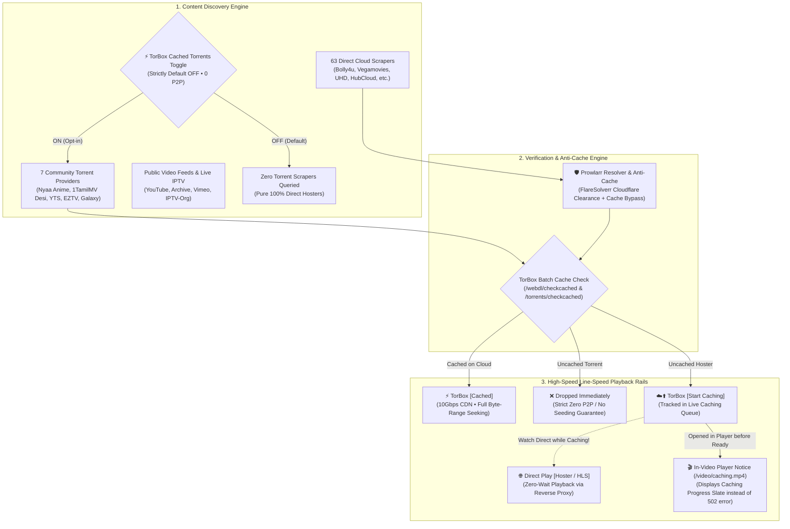

<div align="center">
  <a href="https://github.com/sakinator/hostreamio">
    
  </a>
  <h1 align="center" style="font-size: 2.4rem; font-weight: 900; letter-spacing: -0.5px; margin-top: 12px; margin-bottom: 4px;">▶️ Hostreamio Addon</h1>
  <p align="center"><b>Direct Hosters • Streaming Links • TorBox Cloud Debrid • Smart Proxy • Instant Badges</b></p>
  <p align="center"><i>High-Performance Stream Engine for Nuvio & Stremio (Windows & Android TV / Mobile)</i></p>

  [](https://github.com/sakinator/hostreamio)
  [](https://github.com/sakinator/hostreamio)
  [](https://github.com/sakinator/hostreamio)
  [](https://torbox.app)
  [](https://opensource.org/licenses/MIT)
</div>

> [!NOTE]
> **✨ 100% Vibe Coded with AI:** This entire project is vibe-coded through continuous human-AI agentic collaboration, real-time feedback loops, automated regression test suites, and live self-healing pipelines. High velocity, zero bloat, pure vibes.

A high-performance local Stremio & Nuvio-compatible addon server featuring **70 Stream & Scraper Engines**, **TorBox Debrid Integration**, **TorBox Cached Torrents Toggle (Default OFF • 0 P2P Guarantee)**, **Prowlarr Captcha Resolver & Anti-Cache**, and rich public catalogs (**YouTube, Vimeo, Internet Archive & Dailymotion**) with automatic badge tagging, native 16:9 widescreen video posters, and embedded streaming proxy.

---

## 🌟 Features

- **100% Non-Torrent by Default (Zero P2P Philosophy):** No seeders, no torrent clients, and no IP seeding exposure. Streams directly from fast cloud storage, regional CDNs, and HTTP/HLS broadcasts.
- **70 Scraper Providers & Community Integrations:**
  - **Direct Cloud & HLS Scrapers (63 engines):** Extracts streams across *Bolly4u, DramaDay, MoviesDrive, UHDMovies, MoviesMod, MultiMovies, ToonStream, 4KHDHub, Bollyflix, HDHub4u, Vegamovies, Vadapav, HindMoviez, PlayDesi, YoMovies, RiveStream, LookMovie, VidLink, Movy, Videasy, Cinejoy, FlyStream, X-Downloader, Vuflix, FSOnline, KissKH, Megasource, Nova, Purstream*, and more.
  - **Community Torrent Scrapers (TorBox Cached Only):** *Nyaa.si* (Anime Community), *1TamilMV / TamilBlasters* (Desi & Indian Regional), *AsianDrama Torrent* (Nyaa Live Action), *YTS.mx API*, *EZTV API*, *Knaben*, and *TorrentGalaxy* (PlayTorrio).
- **TorBox Cached Torrents Toggle (Strictly Default OFF • 0 P2P Guarantee):**
  - Interactive toggle in Settings & Server tab. When OFF, 0 torrent scrapers are queried.
  - When enabled, torrent hashes are checked in batch against TorBox debrid. **Only 100% cached items** are served via TorBox's global high-speed HTTPS CDN (`$localBaseUrl/torbox/play`). Uncached torrents are immediately dropped. No uploading, zero seeders needed, zero P2P leakage.
- **Prowlarr-Style Captcha Resolver & Anti-Cache:**
  - Automated FlareSolverr proxy bridge (`ProxyResolverService`) that solves Cloudflare Turnstile, IUAM challenges, and captures clearance cookies (`cf_clearance`).
  - Origin-fresh cache-bypass headers (`Cache-Control: no-cache, no-store, max-age=0`, `Pragma: no-cache`, query nonces) to avoid stale or blocked ISP cache hits.
- **Dedicated Anime Engine (Zero Bloat):** Powered by **HiAnime / Zoro** (#1 best) with **Gogoanime** (#2 fallback) featuring clean `[SUB]` and `[DUB]` tags, absolute episode resolution, and zero P2P torrent overhead.
- **Direct Subtitle APIs (OpenSubtitles v3):** Integrated official zero-rate-limit OpenSubtitles v3 REST API delivering subtitles in 90+ languages with direct `.srt` downloads and a user-facing toggle in settings (`enableOpenSubtitles`).
- **Expanded DDL Hosters (Direct & TorBox):** Direct streaming and TorBox cloud caching across **PixelDrain, GoFile, Buzzheavier, Qiwi, MultiUp, Krakenfiles, Mixdrop, Voe, Filemoon, Doodstream, Streamtape**, and **HubCloud**.
- **Free Global Live IPTV Broadcasts (`iptv-org`):** Over 8,000+ free broadcast channels with live Search, Category filters (*News, Sports, Movies, Animation, Music, Entertainment, Documentary*), and Country filters (*Global, US, UK, IN, CA, FR, DE, ES, IT, AU, JP, BR*). Available both in the native Android app and as the Stremio addon catalog `iptv_global`.
- **In-App Video Player (`media_kit` / `libmpv`) & 200% VLC Super Audio Gain:**
  - Embedded cross-platform video player (`PlayerScreen`) for Android TV, Mobile, and Windows Desktop with hardware-accelerated 4K HEVC/AV1/H.264 rendering.
  - **200% VLC Super Gain:** Amplifies audio up to 200% with floating volume HUD pill and quick-jump preset pills (`100%`, `125%`, `150%`, `200%`).
  - **Dialogue Normalizer:** Real-time FFmpeg `dynaudnorm` filter toggle (`lavfi=[dynaudnorm=f=75:g=15:p=0.95:m=10]`) boosts quiet whispers while softening deafening action explosions.
  - **Smart IPTV / VOD Adaptation:** Automatically detects live IPTV `.m3u8` streams, removes VOD timeline scrubbing, displays live latency status, and auto-reconnects on network drops.
- **Dual Windows Binaries (Desktop GUI + Headless Server Daemon):**
  - **`hostreamio.exe`:** Full native Flutter desktop application with embedded brand icon, 5-tab UI, video player, and theater.
  - **`hostreamio-cli.exe`:** Standalone headless HTTP server daemon (`dart compile exe bin/server.dart`) listening on port 7002.
  - Both executables are bundled together in `hostreamio-windows-x64.zip`.
- **Nuvio Side Navigation Rail & Collapsible Menu (Windows, Android & Web):**
  - **5-Tab Navigation:** 🖥️ **Server & Addon**, 🎬 **Cinema & Series Theater**, 📺 **Free Global Live IPTV**, ⚡ **Caching Queue**, ℹ️ **About & Diagnostics**.
  - **Collapsible 68px Icon-Only Rail:** Defaults to a sleek 68px icon-only width to maximize poster and card screen real estate, expandable on demand.
  - Header and footer cleanly organized into a dedicated About menu to maintain focused, distraction-free playback views.
- **Live TorBox Cloud Caching Queue & In-Video Notice:**
  - Real-time caching status monitor tracking progress bars, download speed, ETA, file size, and state (`⏳ QUEUED`, `⚡ CACHING (xx%)`, `✅ READY TO STREAM`, `❌ FAILED`) with live auto-refresh polling.
  - In-Video Player Notification (`/video/caching.mp4`): When uncached or in-progress streams are launched from players like Nuvio, Stremio, or VLC, rather than terminating with an HTTP error, a sleek animated in-video notification streams cleanly to alert the user that the file is downloading to TorBox cloud storage.
  - 1-tap playback (`▶ Stream`, `🚀 Play With...`) and cloud item deletion right from the queue.
- **Nuvio-Style Dedicated Media Detail Screen:** Selecting any movie, TV series, or search suggestion transitions into a dedicated Hero Detail screen with large backdrop/poster, IMDb rating badge ⭐, year, genres, plot overview, interactive Season & Episode picker (for series), and focused stream list with instant "← Back to Catalog" navigation.
- **External Player Chooser ("Play With..."):** Native Android Intent chooser enabling 1-tap playback in **VLC for Android**, **Just Player**, **MPV**, **MX Player**, or any system-installed media player alongside native in-app playback.
- **TorBox Debrid Integration:**
  - **Batch Cache Checking:** Instantly checks up to 100 links in a single API query (`/webdl/checkcached`), cutting scraper turnaround by 2-3 seconds.
  - **1-Click Cloud Caching:** Direct "⚡ Cache to TorBox" links in Nuvio and the Web Dashboard. Submits uncached links to TorBox's WebDL downloader in 1 click.
  - **High-Speed CDN Playback:** Streams cached hoster files through TorBox's ultra-fast Indian and global CDN nodes with full byte-range HTTP 206 seeking in Nuvio (MPV player).
- **Strict Multi-Key Privacy Guarantee:** All API credentials (**TorBox, OMDb, Fanart.tv, TheTVDB, TMDB**) are strictly saved in your local gitignored `data/config.json`. They are **never** shared, never uploaded to third parties, never tracked, and never committed to GitHub.
- **Short-Term Scrape Cache (12m TTL):** In-memory LRU ring buffer that caches scraped streams for 12 minutes. Repeated playback, switching streams, or backing out in Nuvio is instantaneous (0ms).
- **Fast Dead-Link Filter:** Rapid 1200ms parallel HEAD probe on direct stream links to purge 404/broken file hoster links before they hit Nuvio.
- **Live Ratings & Tomatometer (OMDb API):** Live IMDb ratings (`⭐ 8.8 IMDb`), Rotten Tomatoes tomatometer (`🍅 86% RT`), and Metacritic scores (`Ⓜ️ 74 Metascore`) stamped directly onto stream cards and `/meta` detail responses.
- **Fanart.tv ClearLogos & 4K Artwork:** Transparent ClearLogo PNGs (`hdmovielogo`/`clearlogo`) and crystal-clear 4K backdrops for Nuvio's hero title banner, with automatic fallback to Metahub CDN.
- **TheTVDB Episode Mappings:** Episode mapping for anime, cartoons, and Indian serials. Resolves absolute episode numbers (e.g. `Episode 1089` instead of `S21E72`) and episode titles so scrapers never miss anime releases.
- **Stream Filtering Profiles:**
  - **Clean Drawer Mode:** Automatically strips low-grade CAM, TS, PreDVD, and Telesync releases when high-quality WEB-DL or BluRay copies exist.
  - **Max Resolution Cap:** Configurable resolution limits (`4K`, `1080p Max`, `720p Max`) for bandwidth-constrained or TV devices.
  - **Audio Language Prioritization:** Select your preferred audio language (`Hindi`, `English`, `Tamil`, `Telugu`, `Malayalam`, `Kannada`, `Bengali`, `Punjabi`, `Dual Audio`) to boost matching releases to the very top.
- **Smart Stream Deduplication:** Merges identical CDN streams from multiple providers into a single card with combined tags (e.g. `HubCloud [Direct] (MoviesDrive + Vega)`).
- **Inbuilt Native Badges & Indian Regional OTT Logos:** Native bracketed headers (`[4K] [Remux] [HDR] [Hindi]`) rendered directly as colored badge pills in Nuvio, with logos for **JioHotstar, SonyLIV, Zee5, JioCinema, SunNXT, Aha, Hoichoi, ManoramaMAX, Chaupal, Planet Marathi, MX Player, Lionsgate, Shemaroo, and Voot**.
- **6 Rich Media Catalogs with 16:9 Landscape Posters:**
  - 📺 **Free Global Live IPTV:** 8,000+ live broadcast streams from iptv-org.
  - 🎬 **YouTube Indian Cinema:** Bollywood classics, South Indian Hindi dubbed movies, comedy, and web series.
  - 🌍 **YouTube International:** Curated action, sci-fi, thriller, documentaries, and indie films.
  - 🎥 **Vimeo Staff Picks & Shorts:** Award-winning short films, Staff Picks, animations, and documentaries in native master HLS.
  - 🏛️ **Internet Archive Classics:** Golden Era Hollywood, film noir, silent cinema, classic horror, and vintage Indian cinema.
  - 📺 **Dailymotion Indian & Global:** Hindi movies, dramas, Pakistani serials, and international titles.
- **Embedded Streaming Proxy (`/proxy`):** Transparently forwards protected HLS (`.m3u8`) playlists and injects required `Referer`, `Origin`, and `User-Agent` headers so that Nuvio's internal player plays restricted streams without HTTP 403 errors.
- **4-Tab Android TV & Mobile App (Flutter):** Full D-pad remote navigation and 24/7 background foreground service across Server, Cinema, IPTV, and About screens.
- **4-Tab Responsive Web Dashboard (`/configure`):** Modern dark UI with sidebar navigation rail, instant provider toggles, stream filtering, and live diagnostics.

---

## 🔑 Optional API Keys & Built-In Public Fallbacks (Zero-Key Operation)

**Hostreamio works 100% out of the box with zero required API keys.** All external keys are strictly optional personal enhancements:

| Integration | Key Requirement | 1-Click Signup Link | Zero-Key Public Fallback | What You Get |
|---|---|---|---|---|
| **Direct Cloud Scrapers** | ❌ **No Key Needed** | *Built-in* | 56 Direct HTTP/HLS Hosters | High-speed cloud streaming from HubCloud, Vadapav, VidLink, Movy, etc. |
| **ClearLogos & 4K Artwork** | 🟢 **Optional** (`fanartApiKey`) | [Get Fanart Key ↗](https://fanart.tv/get-an-api-key/) | **Metahub CDN** (`images.metahub.space`) | Transparent PNG ClearLogos & 4K hero backgrounds without any account. |
| **Live Ratings & Tomatometer** | 🟢 **Optional** (`omdbApiKey`) | [Get Free OMDb Key ↗](https://www.omdbapi.com/apikey.aspx) | **Cinemeta Ratings** (`v3-cinemeta.strem.io`) | Pre-configured key + Cinemeta fallback for ⭐ IMDb, 🍅 RT%, and Ⓜ️ Metascore. |
| **Anime & Episode Mappings** | 🟢 **Optional** (`tvdbApiKey`) | [Get TheTVDB Key ↗](https://thetvdb.com/dashboard/account/apikeys) | **Cinemeta & TVMaze** (`api.tvmaze.com`) | Absolute episode counting (`EP 1089`) and episode title aliases. |
| **TorBox Debrid** | 🟢 **Optional** (`torboxApiKey`) | [Get TorBox Key ↗](https://torbox.app/settings) | **Direct Cloud Stream Playback** | If blank, direct cloud links play immediately with zero warnings. |
| **TMDB Metadata** | 🟢 **Optional** (`tmdbApiKey`) | [Get TMDB Key ↗](https://www.themoviedb.org/settings/api) | **TMDB Proxy & Cinemeta** | Speedracelight proxy & Cinemeta ensure queries succeed worldwide. |

### 🔒 Universal Multi-Key Privacy & Security Guarantee
> [!IMPORTANT]
> **Zero Telemetry & 100% Local Storage:**
> - **All your API credentials** (`torboxApiKey`, `omdbApiKey`, `fanartApiKey`, `tvdbApiKey`, `tmdbApiKey`) are stored **strictly and exclusively inside your local `data/config.json`**.
> - The `data/config.json` file is permanently gitignored. Keys are **never** committed to Git, **never** transmitted to telemetry or tracking servers, and **never** exposed in stream titles or public addon manifests.
> - When you test a key in the Web Dashboard, requests are sent directly from your local machine to the official upstream API (TorBox, OMDb, TMDB, TVDB) — no intermediary servers ever see your keys.

---

## 🔗 Stream & Link Tiers Explained

Hostreamio unifies direct file hosters, adaptive HLS web streams, and cloud debrid caching into a clear, prioritized stream hierarchy in Nuvio and Stremio:

```text
┌─────────────────────────────────────────────────────────────────────────────┐
│                           HOSTREAMIO STREAM TIERS                           │
├───────────────────────┬─────────────────────────────────────────────────────┤
│ ⚡ TorBox [Cached]     │ • Pre-cached on TorBox global cloud CDN             │
│                       │ • Instant 0-second playback, no buffering           │
│                       │ • Full byte-range HTTP 206 seeking in MPV / Nuvio   │
├───────────────────────┼─────────────────────────────────────────────────────┤
│ 🌐 TorBox [Cachable]  │ • Link from supported hoster (HubCloud, Pixeldrain) │
│                       │ • Not cached in TorBox cloud yet                    │
│                       │ • Click to send 1-click WebDL cache request & stream│
├───────────────────────┼─────────────────────────────────────────────────────┤
│ 🌐 Direct Play        │ • Original file hoster or cloud storage link        │
│                       │ • Proxied through Hostreamio smart header engine    │
│                       │ • Plays directly without needing a debrid account   │
├───────────────────────┼─────────────────────────────────────────────────────┤
│ ⚡ Adaptive HLS Stream │ • Multi-bitrate master .m3u8 playlists              │
│                       │ • On-the-fly header injection (Referer / Origin)    │
│                       │ • Zero 403 Forbidden player playback errors         │
├───────────────────────┼─────────────────────────────────────────────────────┤
│ 🔄 Smart Deduplication│ • Merges duplicate CDN links across scrapers        │
│                       │ • Example: "HubCloud [Direct] (MoviesDrive + Vega)" │
└───────────────────────┴─────────────────────────────────────────────────────┘
```

### 1. ⚡ `TorBox [Cached]`
* **What it means:** The file hoster link has already been downloaded and cached on TorBox's high-speed cloud servers.
* **Experience:** Instant playback (0ms start delay) streaming directly from TorBox's global and Indian CDN edge nodes with full byte-range seeking (`HTTP 206`).
* **Audio & Badges:** Features complete audio, codec, and resolution badges (e.g. `[4K] [Remux] [HDR] [Hindi]`).

### 2. 🌐 `TorBox [Start Caching]` / `[Cachable]`
* **What it means:** The link is on a hoster supported by TorBox's WebDL engine (HubCloud, PixelDrain, DriveSeed, GDrive, 1fichier, Rapidgator, etc.), but nobody has cached it yet.
* **Experience:** Selecting this link immediately submits the URL to your TorBox account's WebDL downloader in 1 click and begins streaming as soon as caching completes.

### 3. 🌐 `Direct Play [Hoster / Provider]`
* **What it means:** The original hoster download URL or direct cloud stream.
* **Experience:** Completely independent of debrid. Plays directly using Hostreamio's embedded smart proxy (`/proxy`) to inject required browser headers (`Referer`, `Origin`, `User-Agent`) so that Nuvio's internal MPV player plays without CORS or 403 blocks.

### 4. ⚡ `Adaptive HLS (.m3u8)`
* **What it means:** Adaptive bitrate web streams from providers like VidLink, LookMovie, Movy, Vimeo, and Dailymotion.
* **Experience:** Smooth playback that automatically scales resolution based on your internet connection speed.

---

### 💡 The Dual-Rail Implementation Philosophy: Why Hostreamio Is Built This Way

Most conventional Stremio / Nuvio debrid addons enforce a rigid all-or-nothing model: if a file isn't pre-cached on debrid, you are blocked from playback, and if the debrid API experiences downtime or maintenance, the entire addon goes dark.

Hostreamio was architected around a resilient, **Dual-Rail Zero Single-Point-of-Failure (SPOF)** philosophy:



1. **Watch Immediately on Direct Play While TorBox Caches (Zero Idle Wait Time):**
   * When discovering a fresh, rare, or newly scraped 4K/1080p release on HubCloud, DriveSeed, or PixelDrain that isn't yet cached in TorBox's cloud (`[Cachable]`), you don't have to stare at a caching progress bar.
   * You can dispatch the 1-click cloud caching job to TorBox so it is downloaded and accelerated in the cloud, and **simultaneously click `🌐 Direct Play` to start watching the movie right now** without waiting a single second for the cloud download to complete.

2. **Zero P2P Guarantee & Cloud Debrid Bridge (Strictly Default OFF):**
   * Unlike conventional addons that force you into BitTorrent swarms, Hostreamio never exposes your IP to peers.
   * If you opt-in to the Cached Torrents toggle, only releases that are **100% pre-cached on TorBox cloud CDN** are ever served. Uncached torrents are completely discarded at the engine boundary — zero seeding, zero waiting, pure cloud line-speed.

3. **Live Caching Queue & In-Video Player Notice:**
   * Track real-time download progress, transfer speeds, ETA, and size in the dedicated **⚡ Caching Queue** tab.
   * If an in-progress link is opened directly in Nuvio, Stremio, or VLC, Hostreamio serves an animated in-video notice (`/video/caching.mp4`) instead of failing with an HTTP error.

4. **Bulletproof Resilience When TorBox Is Down:**
   * Cloud debrid services can undergo API maintenance, rate-limiting, edge-node routing hiccups, or billing expirations.
   * If TorBox is temporarily offline or unreachable, Hostreamio **never goes dark**. Every single file hoster stream always exposes a parallel `🌐 Direct Play` counterpart routed through Hostreamio's built-in header-injection proxy (`/proxy`). Your streaming theater remains 100% functional 24/7.

5. **No Debrid Lock-In (Subscription Freedom):**
   * A TorBox account is treated as an optional performance enhancement, never a mandatory requirement. Users without a debrid subscription enjoy full, unrestricted access to all 63 direct non-torrent HTTP scrapers, regional Indian OTT feeds, and Asian anime libraries out of the box.

---

## 🚀 Quick Start (Windows PC)

### Method 1: Double-Click the Executable
Run `hostreamio.exe` (or `start.bat`) inside this directory:
```powershell
.\hostreamio.exe 7002
```

Console output:
```text
===============================================================
              ▶️ Hostreamio Addon for Nuvio ▶️         
===============================================================
 Status: RUNNING
 Port:   7002
 Local:  http://localhost:7002
 LAN IP: http://192.168.0.127:7002
---------------------------------------------------------------
 🔌 Nuvio Addon Manifest URLs:
    Localhost: http://localhost:7002/manifest.json
    LAN (TV):  http://192.168.0.127:7002/manifest.json
---------------------------------------------------------------
 🌐 Web Dashboard: http://localhost:7002/configure
===============================================================
```

### Method 2: PowerShell Script
```powershell
.\start.ps1
```

---

## 📱 Android TV (NVIDIA Shield, Fire TV) & Mobile APK

The `android_app` directory contains the complete cross-platform Flutter application tailored for Android TV and mobile devices:

- **D-Pad Remote Friendly:** TV remote focus borders, smooth scale animations, and intuitive D-pad navigation.
- **Background Foreground Service:** Keeps the addon server running 24/7 in the background with wake-lock support.
- **TorBox Debrid Settings Card:** Input and validate your TorBox API key directly on your TV or phone with show/hide password toggle.
- **Automatic IP Detection:** Detects local Wi-Fi IP and displays the ready-to-copy Addon Manifest URL.

### 🔨 GitHub Actions Automated Build
The included CI workflow (`.github/workflows/build-apk.yml`) compiles the release APK on every push to `main`:
1. Go to the **Actions** tab on GitHub.
2. Select **Build Android APK (TV & Mobile)** ➔ Click the latest workflow run.
3. Download the artifact `hostreamio-apk`.
4. Sideload the APK onto your Android TV or phone.

---

## 📺 Step-by-Step Installation in Nuvio & Stremio

### Scenario A: Running on PC & Streaming on Android TV / Fire TV / Phone (Same Wi-Fi)
1. **Launch Hostreamio on your PC:**
   - Run `hostreamio.exe` or `.\start.bat`.
   - Note your PC's local Wi-Fi IP address printed in the console (e.g., `http://192.168.0.127:7002`).
   *(Ensure Windows Firewall allows inbound TCP traffic on port 7002 on your local home network).*
2. **Install Addon Manifest in Nuvio:**
   - Open **Nuvio** on your Android TV, Fire TV, PC, or mobile device.
   - Navigate to: **Settings (⚙️)** ➔ **General** ➔ **Content & Discovery** ➔ **Addons** (under Sources).
   - Click the **`+`** button (or **Install from URL / Custom Addon**).
   - Type or paste your LAN URL:
     ```text
     http://<YOUR_PC_LAN_IP>:7002/manifest.json
     ```
     *(Example: `http://192.168.0.127:7002/manifest.json`)*
   - Click **Install**. Hostreamio will appear under Installed Addons with version `2.0.0`.
3. **Enable OTT & Quality Badges (Fusion Badges in Nuvio):**
   - In Nuvio, go to **Settings (⚙️)** ➔ **General** ➔ **Layout** ➔ **Streams**.
   - Under **Fusion Badge URLs** (or **Badges URL**), enter:
     ```text
     http://<YOUR_PC_LAN_IP>:7002/badges.json
     ```
   - Click **Add / Save**. All stream cards will now render visual quality pills (`[4K]`, `[1080p]`, `[Remux]`) and regional OTT logos (JioHotstar, SonyLIV, Zee5, JioCinema, SunNXT, Netflix, Prime).

---

### Scenario B: Running Standalone on Android TV / Fire TV / Phone (via `hostreamio.apk`)
1. **Install the APK:**
   - Sideload [`hostreamio.apk`](https://github.com/sakinator/hostreamio/releases/latest/download/hostreamio.apk) onto your Android TV or phone (via *Send Files to TV*, *Downloader*, or *ADB*).
   - Open **Hostreamio**. The engine starts automatically in the background on port `7002` with wake-lock support.
   - *(Optional)* Enter your TorBox API key and click **Save & Validate**.
2. **Install into Nuvio (on the Same Device):**
   - Switch to **Nuvio** on your TV or phone.
   - Go to: **Settings (⚙️)** ➔ **General** ➔ **Content & Discovery** ➔ **Addons** ➔ Click **`+`**.
   - Enter the localhost address:
     ```text
     http://127.0.0.1:7002/manifest.json
     ```
     *(Or click the `1-Click Install (Stremio / Nuvio)` button directly inside the Hostreamio Android app).*
   - Click **Install**.
3. **Enable Badges in Nuvio:**
   - In Nuvio: **Settings (⚙️)** ➔ **General** ➔ **Layout** ➔ **Streams** ➔ **Fusion Badge URLs**.
   - Paste: `http://127.0.0.1:7002/badges.json` and save.

---

### Scenario C: Running Nuvio / Stremio on the Same Windows PC
1. **Launch Hostreamio:** Double-click `hostreamio.exe`.
2. **1-Click Install:**
   - Open your browser to `http://localhost:7002/configure`.
   - Click **`🚀 1-Click Install to Stremio / Nuvio`** (or open `stremio://127.0.0.1:7002/manifest.json`).
   - Or in Nuvio Desktop: **Settings (⚙️)** ➔ **General** ➔ **Content & Discovery** ➔ **Addons** ➔ **`+`** ➔ `http://localhost:7002/manifest.json`.
3. **Badges:** Set Fusion Badges URL in Nuvio (**Settings ➔ General ➔ Layout ➔ Streams**) to `http://localhost:7002/badges.json`.

---

### 🛠️ Troubleshooting & Verification
* **Test Manifest in Browser:** Open `http://localhost:7002/manifest.json` (or `http://<LAN_IP>:7002/manifest.json`). It should return valid JSON with `"id": "org.sakinator.hostreamio"`.
* **Windows Firewall Rule (if TV cannot connect):** Run in PowerShell as Administrator:
  ```powershell
  New-NetFirewallRule -DisplayName "Hostreamio Addon Server" -Direction Inbound -LocalPort 7002 -Protocol TCP -Action Allow
  ```
* **Recommended Player in Nuvio:** For the best buffering and seeking experience with TorBox and HLS streams, go to Nuvio **Settings** ➔ **Player** and ensure **ExoPlayer** (default) or **MPV** is selected.

---

## 🔑 TorBox & Metadata Configuration

All external API integrations are 100% optional:
1. Open the Web Dashboard at `http://localhost:7002/configure` (or the Android APK settings screen).
2. Enter any optional keys (TorBox, OMDb, Fanart, TheTVDB, TMDB).
3. Click **Save & Validate**.
4. The dashboard will verify your credentials in real time against upstream APIs.

> [!IMPORTANT]
> **Strict Privacy Guarantee:** None of your API keys are ever shared, committed to Git, or uploaded to third parties. They are stored exclusively in your local `data/config.json`.

---

## 🛡️ Optional: Cloudflare Captcha Bypass (FlareSolverr Setup)

Hostreamio features a **Prowlarr-style Captcha & Cloudflare Resolver** ([`ProxyResolverService`](file:///D:/hostreamio/lib/proxy_resolver.dart)). While Hostreamio bypasses most standard edge blocks automatically using origin-fresh anti-cache headers, indexers like *1TamilMV*, *Vegamovies*, *Bollyflix*, or *Nyaa* occasionally activate strict Cloudflare Turnstile or IUAM challenges ("Just a moment...").

You can connect Hostreamio to **FlareSolverr** to solve these challenges automatically:

### 1. Run FlareSolverr

* **Option A: Via Docker (Recommended):**
  ```bash
  docker run -d \
    --name=flaresolverr \
    -p 8191:8191 \
    -e LOG_LEVEL=info \
    --restart unless-stopped \
    ghcr.io/flaresolverr/flaresolverr:latest
  ```

* **Option B: Windows Standalone (No Docker Needed):**
  1. Download the latest `flaresolverr_windows_x64.zip` from [FlareSolverr GitHub Releases](https://github.com/FlareSolverr/FlareSolverr/releases).
  2. Extract and run `flaresolverr.exe`. It listens locally on `http://localhost:8191`.

### 2. Configure in Hostreamio

1. Open the Web Dashboard at `http://localhost:7002/configure` (or open the Android app).
2. Go to the **🖥️ Server & Addon** tab and scroll to **🛡️ Cloudflare & Anti-Bot Captcha Resolver**.
3. Set the Resolver URL:
   ```text
   http://localhost:8191/v1
   ```
   *(Or `http://<YOUR_NAS_OR_SERVER_IP>:8191/v1` if running on another machine).*
4. Click **Save Settings**.

### 3. How It Operates

* **Zero-Wait In-Memory Cookie Store:** When FlareSolverr solves a challenge, Hostreamio saves the clearance cookie (`cf_clearance`) in memory for 1 hour. All subsequent requests to that domain complete at normal, instant line speeds with zero delay.
* **Purely Optional:** If you do not configure FlareSolverr, Hostreamio simply scrapes directly without external dependencies. Zero bloat is bundled into the Hostreamio binary.

---

## 📂 Project Structure

```text
hostreamio/
├── hostreamio.exe            # Compiled standalone Windows binary
├── hostreamio_icon.svg       # Flat vector app icon
├── start.bat                 # Windows one-click starter
├── start.ps1                 # PowerShell launcher
├── start.sh                  # Linux / Android (Termux) launcher
├── bin/
│   └── server.dart           # Standalone HTTP Addon Server
├── lib/
│   ├── badge_service.dart    # NardBadges stream badge matching engine
│   ├── catalog_service.dart  # YouTube, Vimeo, Archive.org & Dailymotion catalogs
│   ├── config.dart           # Port, timeouts, provider toggles & settings
│   ├── metadata_service.dart # IMDB/TMDB/Cinemeta metadata resolver
│   ├── proxy.dart            # HLS .m3u8 proxy & header injection engine
│   ├── scraper_engine.dart   # Parallel scraper dispatcher & sanitizer
│   ├── scraper_registry.dart # Auto-generated registry of 56 scrapers
│   ├── torbox_service.dart   # TorBox WebDL, cache verification & CDN streaming
│   └── web_ui.dart           # Dark-mode Web Configuration Dashboard
├── android_app/              # Android TV & Mobile Flutter application
│   ├── lib/main.dart         # TV/Mobile UI with TorBox settings card
│   └── lib/server_service.dart # Background server service
└── .github/workflows/
    └── build-apk.yml         # Automated GitHub Actions APK builder
```

---

## 🛠️ List of Active Scrapers (63 Active Providers • 56 Direct Cloud + 7 Cached Torrent)

The unified scraper engine integrates 56 non-torrent direct cloud hosters alongside 7 strictly gated community torrent indexers (cached only on TorBox):

### 🇮🇳 Indian OTT & Regional Scrapers (8 Providers)
| Scraper Provider | ID | Stream Quality | Technology / Hosters | Focus / Description |
| :--- | :--- | :--- | :--- | :--- |
| **Vegamovies** | `vegamovies` | 💎 4K UHD / 1080p | ☁️ Cloud Extractors (HubCloud, V-Cloud) | Bollywood, South Hindi Dubs, HEVC multi-audio releases |
| **Bollyflix** | `bollyflix` | 💎 4K UHD / 1080p | ☁️ Cloud Extractors (DriveSeed, HubCloud) | High-bitrate Bollywood, Hollywood dubbed, multi-audio |
| **HDHub4u** | `hdhub4u` | 💎 4K UHD / 1080p | ☁️ Cloud Extractors (HubCloud, DriveBot) | Latest Hindi cinema, South dubs, direct mirrors |
| **4KHDHub** | `fourkhdhub` | 💎 Pure 4K UHD / Remux | ☁️ Cloud Extractors (HubCloud, Pixeldrain) | Dedicated 2160p 4K UHD Remux, HDR10+ regional copies |
| **HindMoviez** | `hindmoviez` | 📺 1080p FHD | ⚡ Fast HLS / Direct CDN | Bollywood, South Indian dubbed & regional cinema |
| **PlayDesi** | `playdesi` | 📺 1080p FHD | 🎬 Direct MP4 / Cloud Player | Indian TV serials, daily soaps, reality shows & Desi web series |
| **YoMovies** | `yomovies` | 📺 1080p FHD | ⚡ Fast HLS Streams | Hindi, Punjabi, Tamil, Telugu, and Bengali cinema |
| **Vadapav** | `vadapav` | 📺 1080p FHD | 🌐 Direct HTTP CDN | Zero-lag Indian high-speed direct CDN file storage |

### ⛩️ Anime & Asian Drama Scrapers (6 Providers)
| Scraper Provider | ID | Stream Quality | Technology / Hosters | Focus / Description |
| :--- | :--- | :--- | :--- | :--- |
| **AnimePahe** | `animepahe` | 📺 1080p / 720p | ⚡ Fast HLS / Kwk CDN | Sub/Dub anime with multi-bitrate streams & soft subtitles |
| **Gogoanime** | `gogoanime` | 📺 1080p FHD | ⚡ Fast HLS Streams | Simulcast seasonal anime, massive catalog & dual audio |
| **HiAnime** | `hianime` | 📺 1080p FHD | ⚡ Fast HLS / Megacloud | HiAnime CDN, multi-quality streams & soft subtitles |
| **KissKH** | `kisskh` | 📺 1080p FHD | ⚡ Fast HLS Streams | K-Drama, C-Drama & Asian series with multi-language subs |
| **KissAsian** | `kissasian` | 📺 720p / 1080p | ⚡ Fast HLS Streams | Korean & Asian drama catalog with high-speed playback |
| **DramaCool** | `dramacool` | 📺 720p / 1080p | 🎬 Direct MP4 / HLS | Asian dramas, variety shows & East Asian television |

### 🌐 Global & International Scrapers (42 Providers)
| Scraper Provider | ID | Stream Quality | Technology / Hosters | Focus / Description |
| :--- | :--- | :--- | :--- | :--- |
| **VidSrc** | `vidsrc` | 📺 1080p FHD | ⚡ Fast HLS / Multi-Server | Flagship global streaming cluster with adaptive HLS |
| **LookMovie** | `lookmovie` | 📺 1080p FHD | ⚡ Fast HLS Streams | Premium global cinema & television series with soft subs |
| **VidLink** | `vidlink` | 📺 1080p FHD | ⚡ Fast HLS / Cloud CDN | Ultra-fast global CDN streaming network with multi-language subs |
| **MultiEmbed** | `multiembed` | 📺 1080p FHD | ⚡ Fast HLS Aggregator | Aggregated multi-source embed fallback player and resolver |
| **RiveStream** | `rivestream` | 💎 4K / 1080p FHD | ⚡ Fast HLS / Multi-CDN | Multi-server high-bitrate streaming network |
| **Hexa** | `hexa` | 📺 1080p FHD | ⚡ Fast HLS Streams | Multi-server mirror cluster with adaptive bitrate streaming |
| **MegaSource** | `megasource` | 📺 1080p FHD | ☁️ Cloud Extractors | Multi-cloud direct stream aggregator and link resolver |
| **Movy** | `movy` | 📺 1080p FHD | ⚡ Fast HLS / MP4 | Encrypted HLS & MP4 direct streams for movies and series |
| **Videasy** | `videasy` | 📺 1080p FHD | ⚡ Fast HLS Streams | One-click fast buffer global streams across multi-CDN mirrors |
| **Cinejoy** | `cinejoy` | 📺 1080p FHD | ⚡ Fast HLS Streams | International entertainment streams & reliable mirror sources |
| **FlyStream** | `flystream` | 📺 1080p FHD | ⚡ Fast HLS Streams | Low-latency adaptive bitrate streaming network |
| **XDownloader** | `xdownloader` | 📺 1080p FHD | 🌐 Direct HTTP Extractor | Direct file hoster link generator & stream extractor |
| **Vuflix** | `vuflix` | 📺 1080p FHD | ⚡ Fast HLS Streams | Fast cloud HLS stream resolver for international catalog |
| **MovieNight** | `movienight` | 📺 1080p FHD | 🎬 Direct MP4 Streams | Nightly movie archive & high-speed direct streams |
| **FSOnline** | `fsonline` | 📺 1080p FHD | ⚡ Fast HLS Streams | Worldwide movie & webseries provider with multi-quality mirrors |
| **CineSrc** | `cinesrc` | 📺 1080p FHD | 🎬 Direct MP4 / HLS | Direct master HLS & web embeds for movies and series |
| **CineSu** | `cinesu` | 📺 1080p FHD | ⚡ Fast HLS Streams | International film releases and episodic television streams |
| **VidFast** | `vidfast` | 📺 1080p FHD | ⚡ Fast HLS Streams | Optimized low-latency streaming endpoints |
| **VidGod** | `vidgod` | 📺 1080p FHD | ⚡ Fast HLS Streams | Resilient global streaming fallback with fast seek times |
| **VidRock** | `vidrock` | 📺 1080p FHD | ⚡ Fast HLS Streams | Rock-solid CDN streams with multiple quality options |
| **VidUp** | `vidup` | 📺 1080p FHD | ⚡ Fast HLS Streams | Direct video upload player scraper & mirror resolver |
| **VidVault** | `vidvault` | 📺 1080p FHD | 🎬 Direct MP4 Streams | Archived movies & television vault with high retention |
| **VidZee** | `vidzee` | 📺 1080p FHD | ⚡ Fast HLS Streams | Lightning-fast multi-server global player |
| **VixSrc** | `vixsrc` | 📺 1080p FHD | ⚡ Fast HLS Streams | High-performance Vix stream mirror with fast buffering |
| **Purstream** | `purstream` | 📺 1080p FHD | ⚡ Fast HLS Streams | Clean uninterrupted international streams |
| **Nova** | `nova` | 📺 1080p FHD | ⚡ Fast HLS Streams | Global release cluster with multiple server mirrors |
| **FlaxMovies** | `flaxmovies` | 📺 1080p FHD | ⚡ Fast HLS Streams | Global movie releases & web streaming endpoints |
| **Bcine** | `bcine` | 📺 1080p FHD | 🎬 Direct MP4 Streams | Direct international cinema catalog with MP4 streams |
| **Frame** | `frame` | 📺 1080p FHD | ⚡ Fast HLS Streams | High-efficiency adaptive video streams |
| **FshareTV** | `fsharetv` | 📺 1080p FHD | ⚡ Fast HLS Streams | Global TV network episodes & television serials |
| **FSonic** | `fsonic` | 📺 1080p FHD | 🎬 Direct MP4 Streams | Ultra-fast international CDN streams |
| **LMScript** | `lmscript` | 📺 1080p FHD | ⚡ Fast HLS Streams | Script-based lookmovie alternative mirror |
| **Mapple** | `mapple` | 📺 1080p FHD | ⚡ Fast HLS Streams | Fresh global box office & TV episodes |
| **MeowTV** | `meowtv` | 📺 1080p FHD | ⚡ Fast HLS Streams | Curated television shows & movies |
| **PeeStream** | `peestream` | 📺 1080p FHD | 🎬 Direct MP4 Streams | Direct streaming hoster scraper |
| **MoviesDrive** | `moviesdrive` | 💎 4K UHD / 1080p | ⚡ HubCloud / 10Gbps CDN | Instant Typesense JSON search for Bollywood & Hollywood dual audio |
| **UHDMovies** | `uhdmovies` | 💎 4K UHD HDR / DV | ⚡ Direct Cloud Streams | Dedicated 4K HDR, Dolby Vision, 10-Bit HEVC & REMUX cloud streams |
| **MoviesMod** | `moviesmod` | 📺 4K UHD / 1080p | ⚡ Direct Cloud Seeds | Massive Netflix, Prime, Hotstar, SonyLIV & Zee5 OTT dual audio library |
| **MultiMovies** | `multimovies` | 🌐 Multi-Audio | ⚡ Direct Embed Streams | Multi-Audio server (Hindi, Tamil, Telugu, English) streaming |
| **ToonStream** | `toonstream` | 🍙 1080p / 720p | ⚡ Direct Anime Streams | Dedicated Hindi Dubbed Anime, Cartoons & Animated Series |
| **VidApi** | `vidapi` | 📺 1080p FHD | ⚡ Fast HLS Streams | API-driven media scraper endpoint |
| **VidCore** | `vidcore` | 📺 1080p FHD | ⚡ Fast HLS Streams | Core video streaming cluster for global releases |
| **XPass** | `xpass` | 📺 1080p FHD | ⚡ Fast HLS Streams | Bypass scraper for premium media mirrors |
| **ZxcStream** | `zxcstream` | 📺 1080p FHD | ⚡ Fast HLS Streams | Low-latency global stream mirrors |
| **A111477** | `a111477` | 📺 1080p FHD | 🎬 Direct MP4 Streams | Alternative direct stream hoster |
| **DownloadEverything** | `downloadeverything` | 📺 1080p FHD | 🌐 Direct HTTP Extractor | Direct media download & stream extractor |
| **Dulo** | `dulo` | 📺 1080p FHD | ⚡ Fast HLS Streams | High-speed direct stream network |

### ⚡ Community Torrent Scrapers (7 Providers • Gated by TorBox Cached Torrents Toggle • Default OFF • 0 P2P)

> [!NOTE]
> **Strict 0 P2P Guarantee:** These providers are only queried when explicitly enabled by the user in settings (`enableTorboxCachedTorrents = true`). When enabled, torrent hashes are checked in batch against TorBox debrid — **only 100% pre-cached files** are served via TorBox's global high-speed HTTPS CDN (`$localBaseUrl/torbox/play`). Uncached torrents are dropped immediately (zero seeding, zero waiting, zero swarm connections).

| Scraper Provider | ID | Stream Quality | Technology / Hosters | Focus / Description |
| :--- | :--- | :--- | :--- | :--- |
| **Nyaa Anime** | `nyaa` | 🍙 1080p FHD / Remux | ⚡ TorBox Cloud CDN | Global anime, OVA, movies, dual-audio batches & release groups |
| **1TamilMV & TamilBlasters** | `tamilmv` | 💎 4K UHD / 1080p | ⚡ TorBox Cloud CDN | Desi & South Indian regional (Tamil, Telugu, Malayalam, Kannada, Hindi) |
| **AsianDrama Torrent** | `asian_drama_torrent` | 📺 1080p FHD | ⚡ TorBox Cloud CDN | Live-action Asian dramas (K-Drama, J-Drama, C-Drama) from Nyaa Live Action (c=6_1) |
| **YTS.mx API** | `yts` | 🎬 1080p / 4K UHD | ⚡ TorBox Cloud CDN | Lightweight, high-efficiency 720p/1080p/2160p x264/HEVC movie encodes |
| **EZTV API** | `eztv` | 📺 1080p / 720p | ⚡ TorBox Cloud CDN | Daily global television broadcasts, episodic serials & sitcoms |
| **TorrentGalaxy** | `torrent_galaxy` | 💎 1080p / 4K UHD | ⚡ TorBox Cloud CDN | High-retention global movie releases, dual audio & TV packs |
| **Knaben Aggregator** | `knaben` | 🌐 1080p FHD | ⚡ TorBox Cloud CDN | Multi-indexer torrent aggregator for rare & archival releases |

---

## 🔄 Automated Update Pipeline & Reliable Pull Sources (No-AI Pulls)

Hostreamio operates an autonomous, platform-neutral update pipeline designed to keep providers, scrapers, and binaries up to date **without requiring manual AI intervention**.

### Reliable Upstream Pull Sources:
1. **Authoritative Git Repository (`origin/main`):**
   - **Source:** `https://github.com/sakinator/hostreamio.git`
   - **Pull Mechanism:** `git pull --rebase --autostash origin main`
   - **Purpose:** Automatically pulls newly added scrapers, bug fixes, badge rules, and server enhancements without merge conflicts.
2. **GitHub Releases API (Pre-Compiled Binaries & APK):**
   - **Source:** `https://api.github.com/repos/sakinator/hostreamio/releases/latest`
   - **Purpose:** Provides direct release downloads for `hostreamio-windows-x64.zip` and `hostreamio.apk` for standalone installations without Git.
3. **Real-Time Dynamic Domain Mapping (`urls.json`):**
   - **Source:** [`SaurabhKaperwan/Utils/urls.json`](https://raw.githubusercontent.com/SaurabhKaperwan/Utils/refs/heads/main/urls.json)
   - **Purpose:** Tracks real-time active domain rotations for rotating Indian & Asian streaming providers (*VegaMovies, HDHub4u, MoviesDrive, UHDMovies, Bollyflix, HubCloud, VCloud*). Prevents scrapers from breaking when mirror domains rotate.
4. **Upstream PlayTorrio Providers:**
   - **Source:** `https://github.com/ayman708-UX/PlayTorrioV3.git`
   - **Pull Mechanism:** Auto-stashed submodule check inside `upstream/PlayTorrioV3`.

### 1-Click Update Command:
```powershell
dart run tool/update.dart
```
This single command automatically pulls updates, checks upstream providers, regenerates the registry across both the server and Android app, compiles the standalone binary, embeds the 8% rounded brand icon via `rcedit`, and triggers an instant zero-downtime hot-reload on the running addon server.

---

## 🏆 Credits & Acknowledgements

`Hostreamio` stands on the shoulders of giants. We gratefully acknowledge and credit the following pioneering open source developers, communities, and services:

- **[ayman708-UX / PlayTorrioV3](https://github.com/ayman708-UX/PlayTorrioV3)**: Core Dart scraper models, site extractors, and multi-source scraping architecture.
- **[Cloudstream 3 Community](https://github.com/recloudstream/cloudstream)** & Extension Authors (*Hexated, Stormunblessed, Hindi Providers*): Pioneering hoster extraction patterns and cloud link bypass techniques.
- **[Nuvio Team](https://nuvio.app)**: Next-gen TV and desktop streaming player with beautiful native badge pill rendering.
- **[TorBox](https://torbox.app)**: Exceptional debrid infrastructure, lightning-fast WebDL cloud caching, and high-bandwidth global CDN delivery.
- **[Nyaa.si & Tokyo Toshokan](https://nyaa.si)**: Global anime, Asian live-action drama & OST community metadata, indexing, and RSS feeds.
- **[1TamilMV & TamilBlasters Community](https://1tamilmv.tf)**: Premier regional Indian entertainment trackers for Hindi, Tamil, Telugu, Malayalam, and Kannada releases.
- **[YTS.mx & EZTV APIs](https://yts.mx)**: Public community APIs for high-efficiency movie releases and global television series episodes.
- **[IPTV-org Community](https://iptv-org.github.io)**: Public domain worldwide live television broadcasts, logos, categories, and electronic program guides.
- **[OpenSubtitles.org v3 API](https://opensubtitles.com)**: Direct multilingual subtitle synchronization across 90+ languages without mandatory VIP registration.
- **[CNCVerse-Bridge](https://github.com/CNCVerse/Bridge)**: Design inspiration for DNS-over-HTTPS fallback, segment caching, and on-the-fly virtual HLS playlist converter.
- **[Torrentio](https://torrentio.strem.fun)**, **[MediaFusion](https://github.com/mhdzumair/MediaFusion)**, **[Comet](https://github.com/g0ldy/comet)**, **[AIOStreams](https://github.com/Viren070/AIOStreams)** & **[EasyTorbox](https://github.com/sagetendo/EasyTorbox)**: For shaping modern community debrid streaming workflows and Stremio/Nuvio addon conventions.

---

## ✨ Vibe Coded Philosophy & Manifesto

> *"Code at the speed of thought. Guided by vibes, verified by automated test suites."*

This entire codebase — spanning 56 stream scrapers, dynamic HLS proxying, TorBox cloud debrid caching, cross-platform Android TV / mobile interfaces, and live update pipelines — is **100% Vibe Coded**.

### What does "Vibe Coded" mean here?
- **AI-Native Architecture**: Conceived, architected, debugged, and refined through symbiotic interaction between human vision and autonomous AI coding agents (DeepMind Antigravity / Gemini / Claude).
- **Rapid Self-Healing**: Automated QA loops, subagent audits, real-time JavaScript validation (`node -c`), and endpoint stress-testing catch edge cases before they ship.
- **Vibe Velocity**: Shipped iteratively at extreme velocity without bureaucratic technical debt — continuously evolving as streaming protocols, hosters, and community conventions update.
- **As-Is Provision**: As with all vibe-coded software, it is offered purely as open-source research and experimental tooling. Enjoy the vibes responsibly!

---

## ⚖️ GitHub Disclaimer & Legal DMCA Policy

> [!IMPORTANT]
> **GitHub Repository Disclaimer:**
> 1. **No Content Hosted:** This GitHub repository contains **only open-source Dart and Flutter application code**. It does NOT contain, host, store, mirror, link to, or distribute any media files, copyrighted videos, torrents, or pirated content of any kind.
> 2. **Independent Open-Source Utility:** This project is an independent, non-commercial open-source utility developed for educational, interoperability, and personal research purposes.
> 3. **No Affiliation:** This project is NOT affiliated with, sponsored by, endorsed by, or in any way officially connected with GitHub, Stremio, Nuvio, TorBox, Google, YouTube, Internet Archive, Dailymotion, or any of the third-party websites or services indexed by the scraping engines. All product names, trademarks, and registered trademarks belong to their respective owners.
> 4. **Pure Web Indexer:** The software acts solely as an automated search indexer querying publicly accessible search endpoints on the open internet, identical to a standard web browser or search engine query.
> 5. **Zero Media Ownership**: The authors, developers, and maintainers of this project do not own, control, maintain, or manage any of the scraped websites, hosters, content delivery networks (CDNs), or debrid providers indexed by this tool.
> 6. **User Responsibility:** Users are solely responsible for ensuring that their use of this software complies with all applicable local, national, and international laws, regulations, and third-party terms of service.
> 7. **DMCA Takedown Compliance:** Because no media or infringing content is stored in this repository or on any servers operated by the authors, DMCA notices regarding scraped content should be directed to the third-party web host or file storage provider actually hosting the files. For concerns regarding repository source code, please open an Issue or contact the repository owner.

